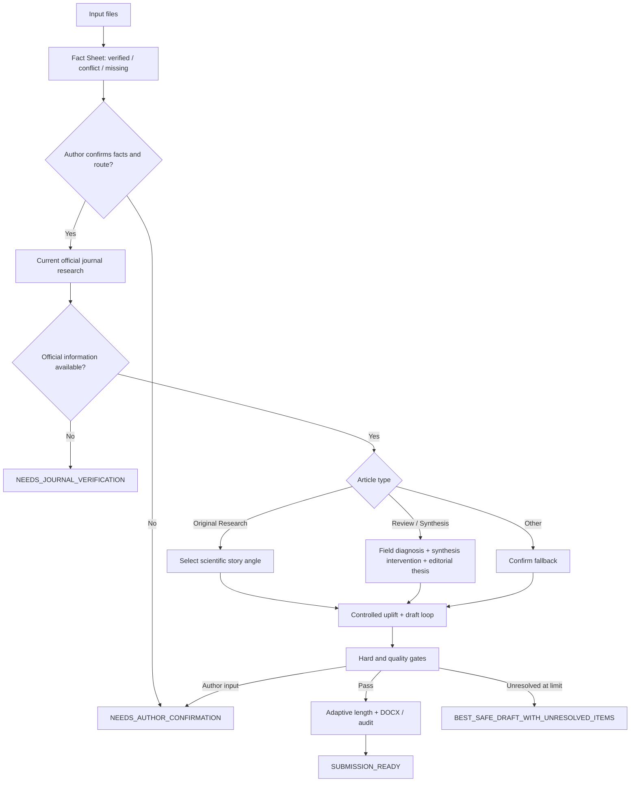

# Architecture

## Design boundary

The Skill instructions perform semantic work: manuscript interpretation, contribution ranking, Research story selection, Review field diagnosis, editorial-thesis selection, journal-conversation synthesis, and claim calibration.

Deterministic scripts perform operations that can be checked mechanically: DOCX extraction and rendering, structured payload validation, placeholder detection, risk-term flagging, audit serialization, package construction, and privacy scanning.

This separation avoids pretending that keyword rules can judge scientific novelty or editorial value.

## State flow

## Final state rule

`SUBMISSION_READY` is impossible when current official journal information was unavailable, a fact conflict remains, required declarations are incomplete, article type is unresolved, or prior-letter use exceeded permission.
