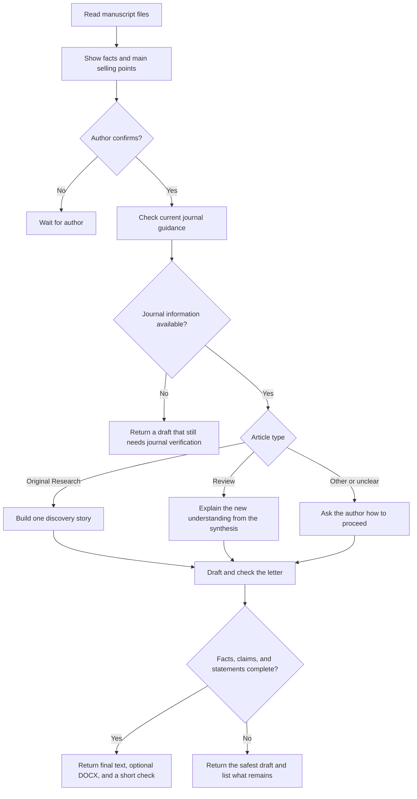

# How the Skill works

The Skill handles the scientific and editorial decisions. Small scripts handle tasks that can be checked mechanically, such as reading and creating DOCX files, finding placeholders, validating structured data, and scanning release packages for privacy risks.

The Skill never labels a letter as ready when facts conflict, required statements are missing, the article type is unresolved, or current journal guidance could not be checked.
